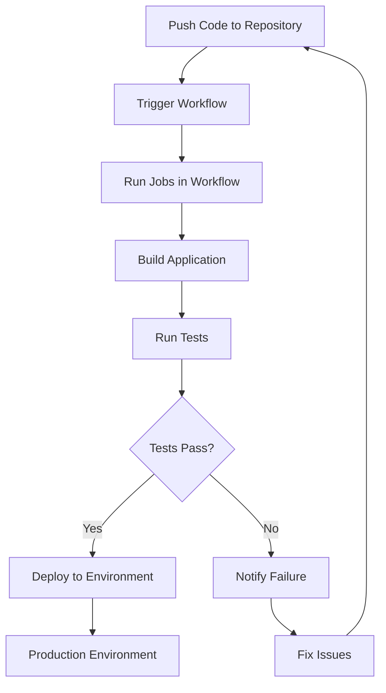

# Github Actions

## Understanding GitHub Actions

GitHub Actions is a powerful automation tool that enables continuous integration and continuous delivery (CI/CD) workflows directly within GitHub repositories. It automates build, test, and deployment processes.

### How GitHub Actions Works



### Key Components

- **Workflows:** Automated processes defined in YAML files
- **Events:** Triggers that start a workflow (e.g., push, pull request)
- **Jobs:** Sets of steps that execute on the same runner
- **Actions:** Reusable units of code for workflows
- **Runners:** Servers that run the workflows

### Example: Deploy to AWS EC2

Here's a practical example of a workflow file that deploys an application to AWS EC2:

```yaml
name: Deploy to EC2

on:
  push:
    branches: [ main ]

jobs:
  deploy:
    runs-on: ubuntu-latest
    
    steps:
    - uses: actions/checkout@v2
    
    - name: Set up Node.js
      uses: actions/setup-node@v2
      with:
        node-version: '14'
        
    - name: Install dependencies
      run: npm install
        
    - name: Build application
      run: npm run build
        
    - name: Deploy to EC2
      uses: appleboy/ssh-action@master
      with:
        host: ${{ secrets.EC2_HOST }}
        username: ${{ secrets.EC2_USERNAME }}
        key: ${{ secrets.EC2_PRIVATE_KEY }}
        script: |
          cd /var/www/app
          git pull
          npm install
          npm run build
          pm2 restart app

```

### Setting Up GitHub Actions

1. Create a new directory in your repository: `.github/workflows`
2. Create a new YAML file (e.g., `deploy.yml`) in the workflows directory
3. Add your workflow configuration to the YAML file
4. Configure necessary secrets in your repository settings:
    - Go to Settings > Secrets and Variables > Actions
    - Add required secrets (e.g., AWS credentials, SSH keys)
5. Push your changes to trigger the workflow

### Best Practices

- Use environment secrets for sensitive data
- Cache dependencies to speed up workflows
- Set up appropriate timeout limits
- Use specific versions of actions instead of 'latest'
- Include proper error handling and notifications

### Common Use Cases

- Automated testing on pull requests
- Building and publishing Docker images
- Deploying to cloud platforms
- Code quality checks and linting
- Automated releases and versioning